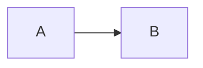

# marsh.city — house style for Claude

This is Jason Marsh's personal site. The whole premise: **adding content is a conversation, not a CMS.** Jason talks to Claude, Claude edits Markdown, git push, GitHub Actions deploys, done.

## Stack

- Astro (static site generator) with content collections
- Markdown + MDX for all content
- Client-side Mermaid for diagrams (loaded on demand from CDN)
- GitHub Pages hosting on `marsh.city` custom domain
- GitHub Actions deploys on push to `main`

## Repo layout

```
src/
  content/
    projects/    # one .md per project
    posts/       # one .md per blog post
    playground/  # one .md per goofy experiment
  pages/         # routes (mostly auto-generated from collections)
  layouts/       # Base.astro, Post.astro
  styles/        # global.css holds all design tokens
public/
  CNAME          # marsh.city — DO NOT remove
```

## Content conventions

**Adding a project**: create `src/content/projects/<slug>.md` with frontmatter:
```yaml
title: ...
description: one-line pitch
status: idea | wip | shipped | archived
repo: https://github.com/...   # optional
url: https://...               # optional
tags: [tag1, tag2]
started: YYYY-MM-DD
updated: YYYY-MM-DD             # bump when meaningfully edited
```

**Adding a post**: `src/content/posts/<slug>.md` with `title`, `date`, optional `description`, `tags`, `draft`.

**Adding a playground item**: `src/content/playground/<slug>.md` with `title`, `description`, optional `url` (external playable link).

## Diagrams: Mermaid is the house style

When a piece of content benefits from a diagram — architecture, flow, timeline, state machine, sequence — **reach for Mermaid first.** It's rendered client-side and styled to match the monstera palette. Just write a fenced code block:

````

````

Use diagrams when they meaningfully convey information. Don't shoehorn them in.

## Design tokens (monstera vibe)

Cream/forest palette in `src/styles/global.css`. Light + dark mode via `prefers-color-scheme`. Fonts: Fraunces (serif headings), Inter (body), JetBrains Mono (code).

**Do not change layout, navigation, design tokens, or component structure without explicitly asking Jason.** Freely add/edit content.

## DNS — DO NOT TOUCH WITHOUT WARNING

Email and web DNS records are configured on this domain. **Never suggest DNS changes without explicitly flagging that MX/TXT records must be left alone.**

## Workflow Jason expects

1. Jason: "add a project for X" / "write a post about Y"
2. Claude: creates the file, commits, pushes
3. GitHub Actions deploys in ~60s

Keep responses brief. Jason knows what he asked for.

## Project Journal — session start routine

At the start of every conversation in this repo, Claude should:

1. **Run `scripts/journal-check.sh`** to fetch recent GitHub activity across Jason's projects
2. **If new commits exist** that haven't been discussed:
   - Mention them conversationally — group by project, summarize the gist ("Looks like you pushed auth middleware changes to MealDeck yesterday")
   - Ask how it went: progress, blockers, anything interesting or frustrating
   - Let the conversation flow naturally — follow up on what Jason finds interesting
3. **After discussing**, offer: "Want to turn any of this into a post?"
   - If yes, draft a post in Jason's voice (see Brand Voice below) and create the file
   - If no, that's fine — move on
4. **Mark discussed commits** by running `scripts/journal-mark-discussed.sh <sha1> <sha2> ...`
5. **If no new activity**, skip the check-in silently and proceed with whatever Jason needs

Don't force the journal flow if Jason jumps straight into a task. Read the room — if he opens with "add a project for X", do that first. The journal is a friendly check-in, not a gate.

### Project page creation

If a discussed project doesn't already have a page in `src/content/projects/`, offer to create one. The site should be a living portfolio — if Jason's actively working on something, it belongs on the site.

### Non-project posts

The journal conversation might surface topics worth writing about that aren't project-specific — accessibility patterns, tooling opinions, industry problems Jason has perspective on. If the discussion goes there, offer to capture it as a standalone post. These don't need to tie back to a specific project.

## Brand Voice — Jason's writing style

Posts on marsh.city should sound like Jason wrote them. Here's the voice:

**Tone:** Practical, first-person, conversational but not casual. Like explaining something to a sharp colleague over coffee. No corporate polish, no filler, no self-deprecation for laughs.

**Structure:**
- Lead with the concrete situation, not the abstract principle
- Show the reasoning behind decisions — tradeoffs, constraints, what didn't work
- Use real details: specific numbers, actual error messages, named tools
- End with what's next or what you'd do differently — not a tidy bow

**What to avoid:**
- Marketing language ("game-changing," "revolutionary," "leverage")
- Hedging filler ("In this post, I'll discuss..." — just discuss it)
- Performative humility ("I'm no expert, but...")
- Listicles or "5 tips" format unless it genuinely fits
- Emoji in prose (fine in UI, not in writing)

**Accessibility angle:** Jason is Director of Technology at a nonprofit serving older adults and people with disabilities. When accessibility comes up, it's from lived professional experience deploying tech to real users — not theoretical compliance checkbox thinking. This perspective is a differentiator; lean into it when relevant.

**Length:** 500-1500 words typically. Say what needs saying, stop when it's said.

**Reference post:** `src/content/posts/building-radiogridxl.md` is the canonical example of the voice.
