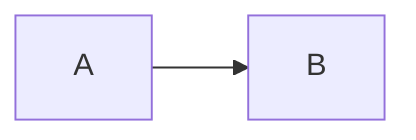

# marsh.city — house style for Claude

This is Jason Marsh's personal site. The whole premise: **adding content is a conversation, not a CMS.** Jason talks to Claude, Claude edits Markdown, git push, GitHub Actions deploys, done.

## Stack

- Astro (static site generator) with content collections
- Markdown + MDX for all content
- Client-side Mermaid for diagrams (loaded on demand from CDN)
- GitHub Pages hosting on `marsh.city` custom domain
- GitHub Actions deploys on push to `main`

## Repo layout

```
src/
  content/
    projects/    # one .md per project
    posts/       # one .md per blog post
    playground/  # one .md per goofy experiment
  pages/         # routes (mostly auto-generated from collections)
  layouts/       # Base.astro, Post.astro
  styles/        # global.css holds all design tokens
public/
  CNAME          # marsh.city — DO NOT remove
```

## Content conventions

**Adding a project**: create `src/content/projects/<slug>.md` with frontmatter:
```yaml
title: ...
description: one-line pitch
status: idea | wip | shipped | archived
repo: https://github.com/...   # optional
url: https://...               # optional
tags: [tag1, tag2]
started: YYYY-MM-DD
updated: YYYY-MM-DD             # bump when meaningfully edited
```

**Adding a post**: `src/content/posts/<slug>.md` with `title`, `date`, optional `description`, `tags`, `draft`.

**Adding a playground item**: `src/content/playground/<slug>.md` with `title`, `description`, optional `url` (external playable link).

## Diagrams: Mermaid is the house style

When a piece of content benefits from a diagram — architecture, flow, timeline, state machine, sequence — **reach for Mermaid first.** It's rendered client-side and styled to match the monstera palette. Just write a fenced code block:

````

````

Use diagrams when they meaningfully convey information. Don't shoehorn them in.

## Design tokens (monstera vibe)

Cream/forest palette in `src/styles/global.css`. Light + dark mode via `prefers-color-scheme`. Fonts: Fraunces (serif headings), Inter (body), JetBrains Mono (code).

**Do not change layout, navigation, design tokens, or component structure without explicitly asking Jason.** Freely add/edit content.

## DNS — DO NOT TOUCH WITHOUT WARNING

Email and web DNS records are configured on this domain. **Never suggest DNS changes without explicitly flagging that MX/TXT records must be left alone.**

## Workflow Jason expects

1. Jason: "add a project for X" / "write a post about Y"
2. Claude: creates the file, commits, pushes
3. GitHub Actions deploys in ~60s

Keep responses brief. Jason knows what he asked for.

## Project Journal — session start routine

At the start of every conversation in this repo, Claude should:

1. **Run `scripts/journal-check.sh`** to fetch recent GitHub activity across Jason's projects
2. **If new commits exist** that haven't been discussed:
   - Mention them conversationally — group by project, summarize the gist ("Looks like you pushed auth middleware changes to MealDeck yesterday")
   - Ask how it went: progress, blockers, anything interesting or frustrating
   - Let the conversation flow naturally — follow up on what Jason finds interesting
3. **After discussing**, offer two things:
   - **Project update**: "Want to add an update to the project page?" — a dated entry in the `## Updates` section of the relevant project file. Short, factual, what changed or what's next.
   - **Blog post**: "Want to turn any of this into a post?" — a standalone post when the topic warrants deeper writing.
   - Either, both, or neither is fine — read the room.
4. **Mark discussed commits** by running `scripts/journal-mark-discussed.sh <sha1> <sha2> ...`
5. **If no new activity**, skip the check-in silently and proceed with whatever Jason needs

Don't force the journal flow if Jason jumps straight into a task. Read the room — if he opens with "add a project for X", do that first. The journal is a friendly check-in, not a gate.

### Project page creation

If a discussed project doesn't already have a page in `src/content/projects/`, offer to create one. The site should be a living portfolio — if Jason's actively working on something, it belongs on the site.

### Project updates

Project pages can have a `## Updates` section at the bottom with dated entries (newest first). Format:

```markdown
## Updates

### 2026-04-26
Brief entry about what changed, what's next, or what was decided.
```

Keep entries short and factual. These are devlog entries, not blog posts. Add them when there's something worth noting — don't pad with filler updates.

### Non-project posts

The journal conversation might surface topics worth writing about that aren't project-specific — accessibility patterns, tooling opinions, industry problems Jason has perspective on. If the discussion goes there, offer to capture it as a standalone post. These don't need to tie back to a specific project.

## Voice and authorship

The site has two content types with different voices:

### Project pages — first-person "I" (Jason)

Project pages are written in Jason's voice. He's the author: he directs the work, makes the calls, and ships it. Claude Code implements, but the copy does not share authorship — crediting the tool as a co-author muddies whose capability the page exists to show, and "made with AI" is aging into "made with a computer." Pragmatic, measured, honest about tradeoffs.

- "I built / I designed / I decided / I learned" — the making and the directing are both Jason's. Don't hand any of it to a "we".
- First person *throughout* the body, including bio and motivation ("I'm the Director of Technology...", "I do my best thinking while driving"). Don't switch to third-person "Jason" mid-page — it clashes with the "I" voice. The name "Jason" belongs in the byline and the about/colophon, not in the narrative.
- "I orchestrate, AI implements" is the preferred framing for the working relationship — Jason prefers "orchestrate" over "direct".
- Describe the process with its real discipline: directing, reviewing what the AI produces, confirming it does what was intended, deciding what ships. It's still programming — judgment and responsibility stay with Jason. Avoid cowboy framing ("point it at the problem," "vibe and ship") that implies blind acceptance.
- Neutral description is the default when no actor needs naming ("The catalog has two views"). Prefer it over forcing "I" into every sentence.
- **Never fabricate experiences, anecdotes, or motivations.** If Jason didn't confirm it, don't write it. Interview first, draft second.
- Technical sections can just explain the thing without attribution.
- The AI's role is stated **once, as a method**, on the colophon (`/oak`) and the about page — never inside project copy. Project pages don't name Oak/Claude as a collaborator.
- The organizational "we" is fine where Jason speaks as part of the nonprofit ("the people we serve") — that's Lighthouse, not the AI.

### Blog posts — same first-person "I"

Posts use the same first-person voice as project pages. Practical, direct, conversational but not casual.

- Lead with the concrete situation, not the abstract principle
- Show the reasoning behind decisions — tradeoffs, constraints, what didn't work
- Use real details: specific numbers, actual error messages, named tools
- End with what's next or what you'd do differently — not a tidy bow
- "I" for the work; third-person "Jason" only for biographical framing
- **Interview Jason for facts before drafting.** Don't assume his experiences or opinions.

### Shared rules for all content

- No marketing language ("game-changing," "revolutionary," "leverage")
- No hedging filler ("In this post, I'll discuss..." — just discuss it)
- No performative humility ("I'm no expert, but...")
- Don't brand the process "vibe coding" — the term is curdling into a sellout/slop label that undercuts the orchestration framing. Name the method as orchestration or building through conversation; "coding by eye" is fine for a visual/creative piece.
- No emoji in prose
- 500-1500 words typically. Say what needs saying, stop when it's said.
- When referencing Jason's AT work or people with disabilities, be accurate and professional. Don't invent scenarios. Don't frame users as helpless. Don't overstate Jason's role. Use the facts from his resume and what he tells you.

**Reference post:** `src/content/posts/building-radiogridxl.md` for Jason's first-person voice.
**Reference project:** `src/content/projects/whatcanhelp.md` for the first-person narrator.
