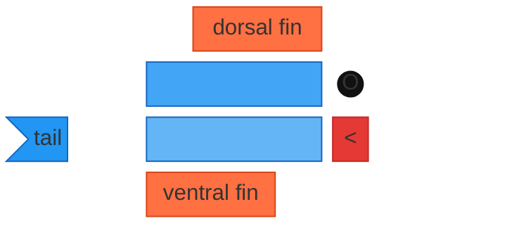
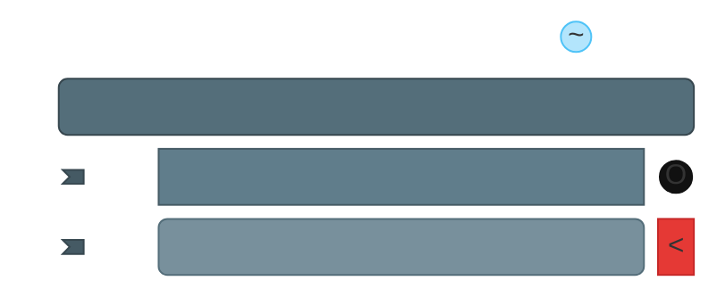
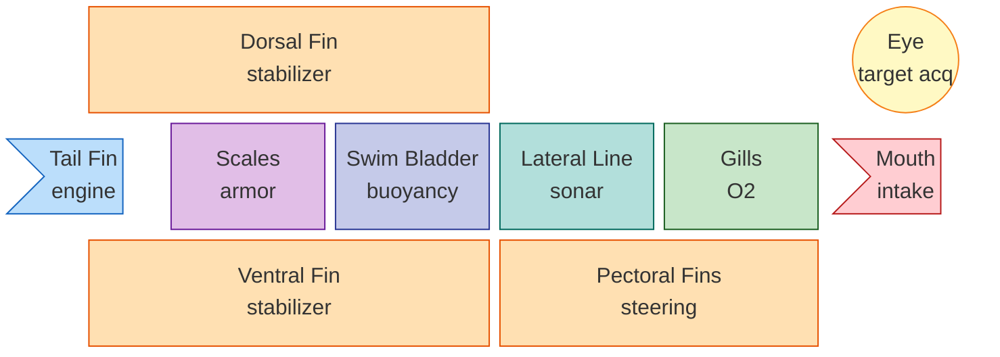

[Mermaid](https://mermaid.js.org/) block diagrams are for flowcharts. Boxes, arrows, the occasional rhombus. We tried to draw animals with them anyway. The results range from "okay, sure" to "what is happening."

No SVG, no images. Just nodes on a grid and a bad attitude.

## The Fish

The fish works. Two-tone body, a flag-shaped tail, a red wedge for the mouth, a tiny black circle for the eye. If you squint, it is recognizable as a fish. This is the high water mark.

## The Whale

This was meant to be a whale. We rewrote it four times. Each version was worse in a new and interesting way. What you see below is the version we stopped at, not because it is correct but because we ran out of ideas. The spout floats above the body like a thought bubble. The tail flukes have wandered off to the left to consider their life choices. The eye and mouth have been deputized to represent "head" by sheer force of will.

It is, technically, a whale.

## The Fish (system architecture)

Same fish. This time each labeled component sits where it would anatomically — mouth at the front, eye up top, tail behind, fins where fins go. The labels keep the deadpan systems-engineering tone.

We tried doing this with a flowchart first. Dagre kept routing the arrows through the swim bladder.

