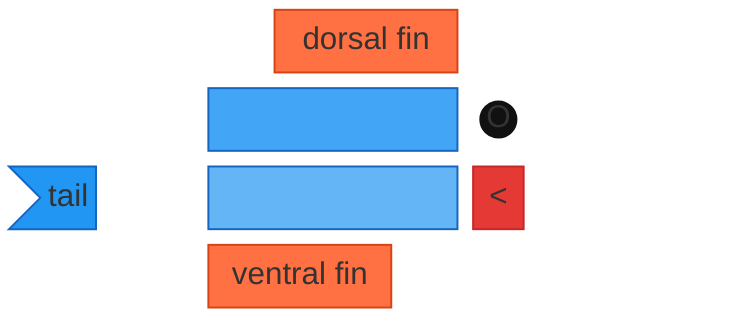
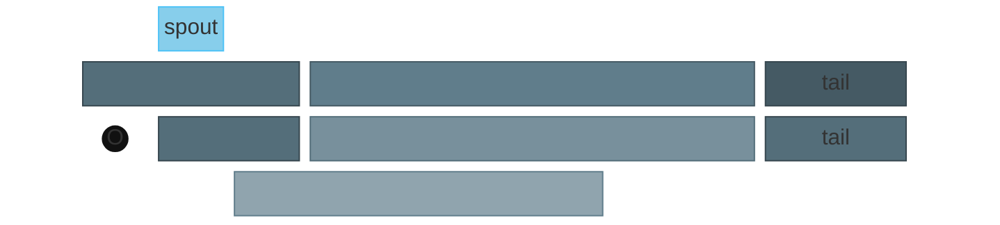
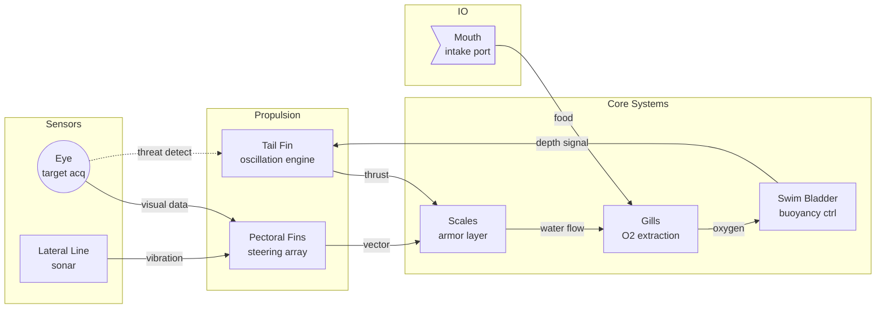

What happens when you try to draw animals using a diagramming tool designed for software architecture? These are built entirely from [Mermaid](https://mermaid.js.org/) block diagrams - the same tool meant for flowcharts and sequence diagrams. No SVG, no images, just nodes on a grid.

## The Fish

## The Whale

## The Fish (system architecture)

Same fish, documented like enterprise software.

