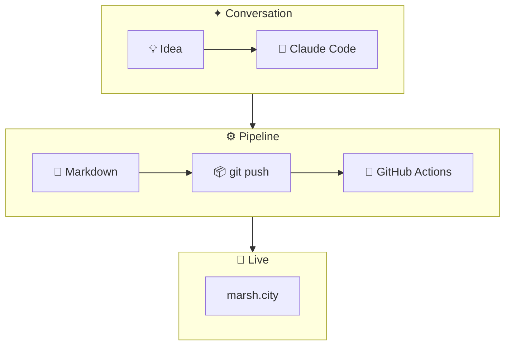

The site you're reading right now. Built with [Astro](https://astro.build), deployed via GitHub Pages, designed to feel like a quiet reading nook in a forest of monstera leaves.

## How it works

Adding content is a conversation, not a CMS. I describe what I want, Claude writes the Markdown, and a push to `main` deploys in under a minute.

## Stack

- **Astro** — static site generator with content collections
- **GitHub Pages** — free hosting on a custom domain
- **Mermaid** — diagrams as code, rendered client-side
- **GoDaddy DNS** — pointing `marsh.city` at GitHub Pages, Apple Mail via iCloud untouched
