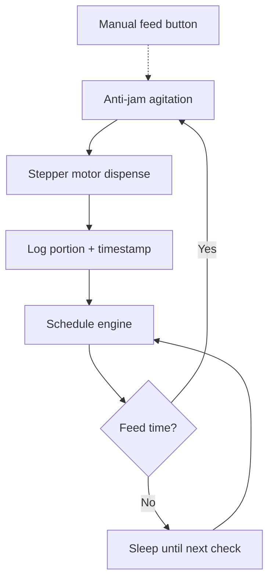

Jason has two ragdoll cats - Frida and Charlie - and the store-bought feeder wasn't cutting it.

| | Store-bought | PetFeedr |
|---|---|---|
| **Power** | 4x D batteries | USB-powered Pi |
| **Capacity** | Small hopper, frequent refills | Custom hopper size |
| **Stability** | Lightweight, cats knocked it over | Heavy, secured base |
| **Lid** | Popped open on impact, food everywhere | Locking lid |
| **Programming** | Tiny LCD, bad button ergonomics | Web interface from any device |
| **Schedule** | Fixed times only | Randomization mode (±30 min) |

We built a Raspberry Pi-powered feeder with a web interface, microstepping motor control, and a deploy pipeline - admittedly a lot of engineering for two cats, but it's been running reliably for about two years now.

<video src="/images/petfeedr/petfeedr-demo.webm" autoplay loop muted playsinline alt="PetFeedr demo showing dashboard, manual feeding, settings panel, and dark mode toggle"></video>

## What it does

Configurable feeding schedule with portion sizes - small, medium, or large. An optional randomization mode shifts each feeding by up to 30 minutes daily so the cats don't learn the exact schedule. (They figured out the general window anyway.)

The web interface shows a visual timeline of today's schedule, a 14-day activity log, and weekly stats with portion tracking. There's a manual feed button for on-demand use. The whole thing installs as a PWA.

## How it works

Python and Flask on a Raspberry Pi, driving a NEMA 17 stepper motor through a DRV8825 driver. The motor runs at 1/16 microstepping for quiet operation, with an anti-jam agitation cycle that reverses slightly before each dispense. Portion control is calibrated to step count - 100 steps per quarter cup.

The scheduling engine runs as a systemd service that auto-restarts on failure. A deploy script handles SSH-based updates with automatic backups. Runs headless on the local network.

A simulation mode auto-detects missing GPIO and mocks it, so the web interface works on any machine during development.

## Updates

### 2026-04-26
V1 has been running reliably for about two years. Jason is exploring a v2 focused on simplifying the design, reducing cost, and improving the aesthetics.
