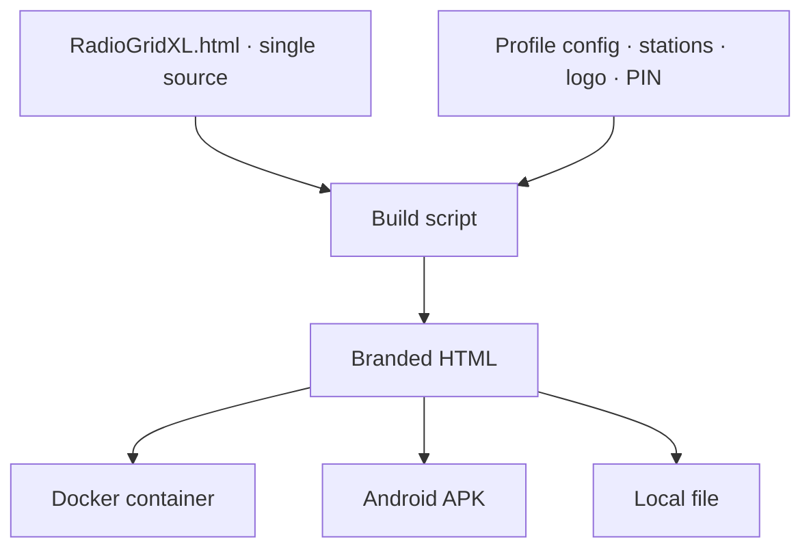

RadioGridXL is an internet radio app built for older adults and people with disabilities - the users mainstream music apps tend to leave behind. Big buttons, no account, no ads, nothing to set up. I built it as a single HTML file with no dependencies, no build step, and no backend, and it's deployed at the nonprofit where Jason directs technology, in the hands of people who just want to listen to music without fighting the interface.

[Try the live demo](/radio/)

## The interface

Big buttons, one per station. Tap to play, tap again to pause. The default dark theme keeps the focus on the station buttons - each one gets an emoji icon, a color, and a subtitle. The layout measures available viewport space and calculates button sizing dynamically, filling the screen whether there's one station or eight.

Add more stations and the layout shifts to a responsive grid - two columns here on mobile, scaling up to four on desktop. Each station gets its own color from eight palettes. No media query breakpoints - the grid math is pure viewport calculation.

## Playback and controls

When a station is playing, the interface shifts - the active button highlights, a connection dot in the header turns green, and the transport bar lights up. There are two control modes. Simple gives you a single stop button. Advanced adds station skip and a sleep timer, and splits stopping into two actions - a soft Pause that holds the stream so you can resume where you left off, and a full Stop. The transport icons are inline SVG rather than unicode glyphs, so iOS can't swap in its own skeuomorphic emoji versions. Wake Lock keeps the screen on during playback. Auto-retry handles dropped connections with up to four attempts before showing an error.

## Technician settings

Five taps on the logo opens a PIN-protected settings panel - hidden enough that no one's found it by accident yet. A technician can configure everything without exposing that complexity to the end user - theme, text size, volume cap, control mode, accessibility features, and the station list itself. Lockout escalates after failed PIN attempts.

## Stream browser

The stream browser searches the Radio Browser API by name, country, or genre. Preview a station before adding it. Pick an emoji icon and color theme per station.

## Accessibility

I went accessibility-first, not accessibility-eventually, so I designed for older adults and people with disabilities from the start - it shaped the architecture:

- WCAG AA verified contrast across all eight color palettes plus high-contrast monochrome modes (shown above)
- Full screen reader support - ARIA roles, labels, and live regions throughout
- Optional text-to-speech that announces playback actions via the Web Speech API
- Audio chimes on play/pause using Web Audio API oscillators
- Haptic feedback on mobile devices
- Keyboard navigation with focus trapping in overlays
- An "Ultra" size mode that scales with viewport dimensions for low vision users
- Simple and Advanced transport modes to control cognitive load

## How it's built

One HTML file. Around 4,600 lines of vanilla HTML, CSS, and JavaScript. Not how anyone would recommend structuring an app, but the constraints justified it. Zero external dependencies. Copy the file to a device, open it in a browser, it works.

A profile system supports branded variants - a build script swaps in custom station lists, logos, and PINs for different deployments. The Lighthouse Center deployment runs as a Docker container. There's also an Android APK build path using Gradle.

## Updates

### 2026-05-29
Synced the live demo to v7.5.5. Advanced mode now separates Pause - a soft, resumable hold on the stream - from Stop, which tears the connection down fully. The transport icons moved from unicode characters to inline SVG so iOS stops substituting its skeuomorphic emoji glyphs. v7.5.2 re-centered the logo and regenerated the maskable PWA icons, since the home-screen mark was getting cropped off-center on add-to-home-screen.

### 2026-05-28
Updated the live demo to v7.5.1. The big addition since launch is a PWA shell - installable, with lock-screen audio controls (MediaSession), auto-resume, and offline app-shell caching via a service worker. Also added backup/restore of settings, accessibility presets, and per-stream loudness leveling so stations don't jump in volume. The demo moved from `/radio.html` to `/radio/` so the service worker stays scoped to its own directory instead of the whole site.

### 2026-04-26
Shipped and deployed. The profile system needs a web-based editor so other organizations can create branded deployments without touching code. Also looking at Service Worker caching for unreliable networks.
