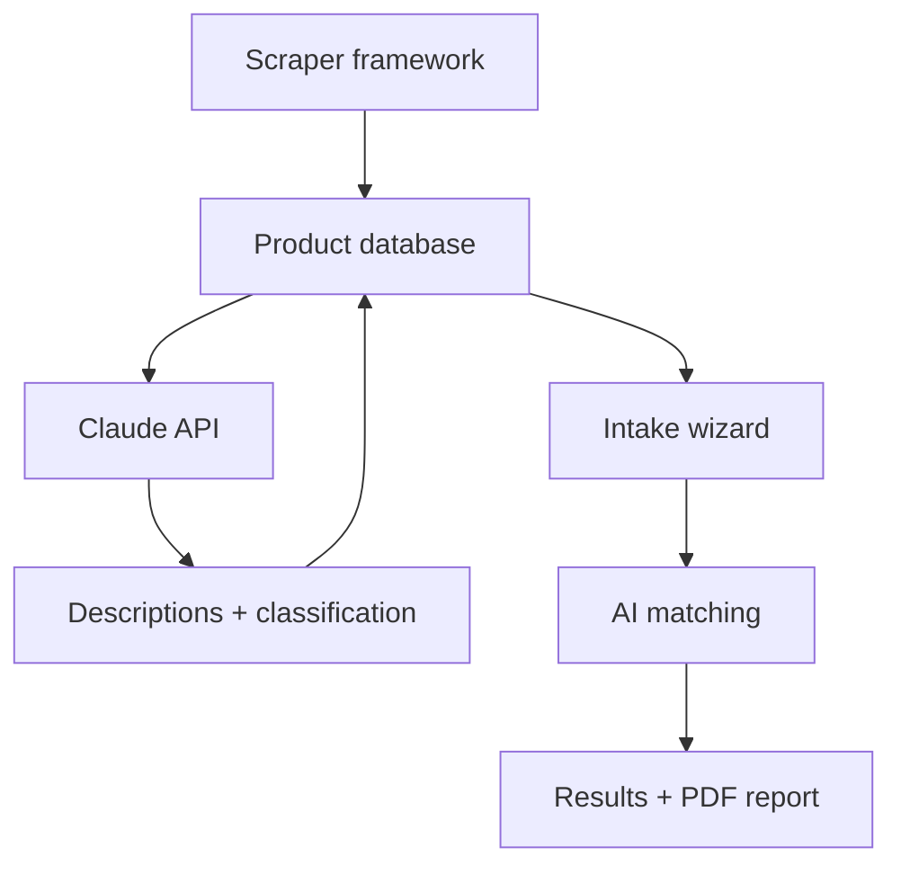

Jason is the Director of Technology at a nonprofit in Duluth that serves people with disabilities and aging populations. Part of that work is assistive technology - evaluating devices, configuring them for clients, running an AT lending library, answering colleagues' questions about what works. WhatCanHelp grew out of a question he kept coming back to: what would it look like if the AT industry had better discovery tools?

We built a free tool that brings together 3,600+ assistive technology products from 20 vendors in one searchable place, with AI-powered descriptions, guided intake matching, and PDF reports. No account required, no tracking.

## The interface

The landing page leads with category pills - Communication, Vision & Sight, Hands & Fine Motor, Hearing, and others - so people can jump straight to what's relevant. Below that, a three-step overview explains the workflow: search and filter, read honest descriptions, share with your team. The visual design leans warm and editorial - cream backgrounds, serif typography, generous spacing. We wanted it to read more like a reference document than a tech product.

The browse page shows the full catalog with faceted filters along the side: challenge area, product type, device or platform, ease of setup, price range, age group, manufacturer, and funding sources. Products display as a card grid or a dense list view, with search by name, brand, or keyword. A "Recently Added" section highlights new products, and you can share filtered views or export results as CSV.

The guided intake asks two questions. First: what are the challenges - limited hand/arm movement, difficulty speaking, low vision, hearing loss, memory or cognitive, reading or learning, daily tasks, or computer/phone access. Second: optional refinements for age group, budget, platform, and a free-text field for anything the structured questions don't cover. A disclaimer at the bottom is clear that this explores options, not replaces a professional assessment.

## Complexity ratings

Every product is rated on a four-tier scale:

| Tier | Meaning |
|---|---|
| **Ready to use** | Unbox and start using independently |
| **Guided setup** | Some initial help needed, then independent |
| **Professional recommended** | Works best with professional guidance |
| **Professional required** | Needs professional assessment and configuration |

The badges show up everywhere - browse, detail pages, reports. Finding the right product isn't just about matching needs. It's also about whether someone - or their support network - can realistically get the device set up and keep it working. A product that addresses the right need but requires professional configuration is a different recommendation than one someone can unbox and start using.

## Product detail and AI descriptions

Each product page has three main sections. "About This Product" is a plain-language description generated by Claude, reviewed and stored rather than generated on the fly. "What Setup Looks Like" walks through what happens out of the box - step-by-step for products that need configuration, or a simple "ready to use" for things that just work. "Classification" shows the full taxonomy tags across needs, product type, platforms, and funding sources.

We wrote the descriptions to be understandable without AT industry jargon - useful for families and clients who are researching on their own, not just professionals who already know the landscape. AT terminology throughout the site is highlighted with plain-language glossary definitions on hover.

## PDF reports

After intake, the tool generates a PDF report - a summary of the person's profile, matched products with explanations, complexity warnings, and guidance notes. The reports use the same visual language as the web interface so they feel like a cohesive document you can bring to a funding meeting, share with your team, or hand to a family.

## Accessibility controls

A settings dropdown in the header offers theme switching (auto, light, dark), text size adjustment, line spacing controls, and a reduce motion toggle. The sizing uses relative units throughout, so scaling up doesn't break layouts. The color system targets WCAG AA contrast ratios across all themes.

## Blog

The site has a blog with honest guides, product roundups, and news written for the people who actually use AT - not vendor marketing copy.

## How it's built

Node.js and Express, SQLite, vanilla JavaScript on the frontend. The Anthropic API powers product descriptions, intake matching, and classification. A pluggable scraper framework pulls product data from 20 manufacturer and vendor sites - with content hashing for change detection and weekly update cycles.

The taxonomy is tag-based across seven dimensions: need, solution type, platform, complexity, price band, funding eligibility, and age range. Products can be tagged across multiple needs without being duplicated, which avoids rigid category structures.

## Updates

### 2026-05-09
Live at WhatCanHelp.com. 3,600+ products from 20 vendors browsable with faceted filters, guided intake, PDF reports, glossary, blog, and accessibility controls. Fresh screenshots and project page revision to match the shipped product.

### 2026-04-26
Project page is up. Still in active development - current focus is data cleanup, normalizing product records and testing the intake matching pipeline. Exploring when to publish publicly.
