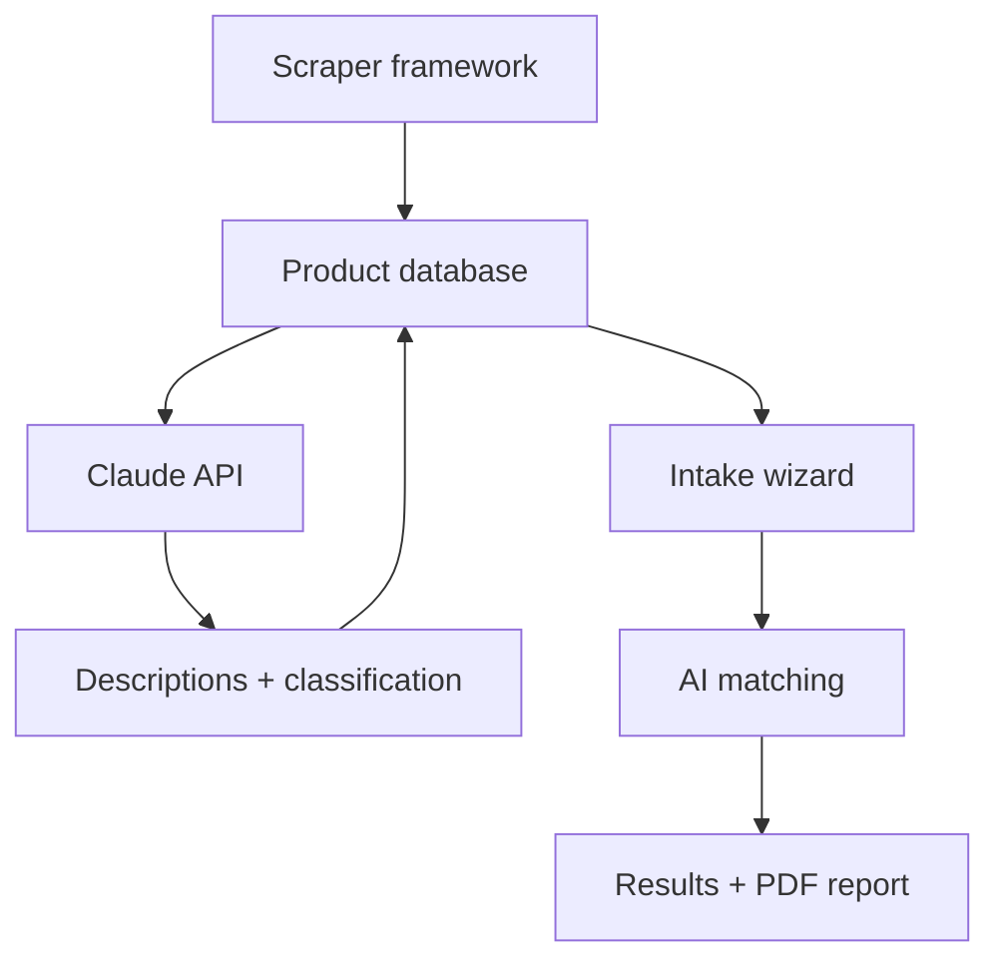

Jason is the Director of Technology at a nonprofit in Duluth that serves people with disabilities and aging populations. Part of that work is assistive technology - evaluating devices, configuring them for clients, running an AT lending library, answering colleagues' questions about what works. WhatCanHelp grew out of a question he kept coming back to: what would it look like if the AT industry had better discovery tools?

We built a free tool that brings together 5,000+ assistive technology products from 23 vendors in one searchable place, with AI-powered descriptions, a freeform intake that produces a matched shortlist, and PDF reports designed for funding meetings and IEP appendices. No account required, no tracking.

## The interface

The landing page leads with one thing: a "Describe the situation" button. Below it, a short pitch (shortlist with complexity tiers and funding pathways, plus a PDF summary for funding meetings or IEP appendices) and a vendor-neutral / updated weekly / independent tagline. A "How it works" section breaks the flow into three steps: describe, review, export. Secondary links go to the full catalog and the glossary for people new to AT.

The catalog shows 5,060 products with faceted filters along the side: challenge area, product type, device or platform, ease of setup, price range, age group, manufacturer, and funding sources. A "Recently Added" thumbnail strip surfaces new products with category badges. Below that, a dense table view with manufacturer, type, platform, complexity tier, and how recently each entry was updated. A card grid view is one toggle away, and you can share filtered views or export results as CSV.

The intake is freeform. One textarea, prompted with "Who it's for, what they're trying to do, what's in the way, and any constraints. Clinical or plain - whatever feels natural." An AT specialist can write "58yo post-CVA, R-hemiparesis, returning to work; needs one-handed Windows input and voice control." A parent can write "my 8-year-old has trouble communicating at school." Both get the same matching engine. A privacy note explains that input goes to Anthropic's API under their no-training terms, and intake text is not stored on the server.

We tried a structured checkbox flow first. It looked tidy and felt rigid - the real situations people brought us never fit cleanly into the boxes. Freeform text trusts the user to describe what's actually going on; Claude does the structured extraction on the backend.

## Complexity ratings

Every product is rated on a four-tier scale:

| Tier | Meaning |
|---|---|
| **Ready to use** | Works on its own with no setup or training |
| **Setup with instructions** | Some configuration needed, but a tutorial gets you there |
| **Professional guidance helps** | You can start alone, but a pro gets much better results |
| **Professional setup required** | Needs professional assessment and configuration |

The badges show up everywhere - catalog, detail pages, reports. Finding the right product isn't only a matching problem. Whether someone (or their support network) can realistically get the device set up and keep it working matters just as much. A product that fits the need but requires professional configuration is a different recommendation than one someone can unbox and start using.

## Product detail and AI descriptions

Each product page leads with the essentials: image, price, manufacturer, complexity badge, when the entry was last verified, and shortlist + share buttons. For tiers that benefit from a clinician, a callout near the top points to RESNA's AT Professional Finder, ASHA ProFind for SLPs, and State AT Act Programs. Below that, a Claude-generated summary (reviewed and stored, not generated on the fly) plus a "What setup looks like" walkthrough, and the full classification across needs, product type, platforms, and funding sources.

Descriptions are written to be understandable without AT industry jargon - useful for families and clients researching on their own, and faster to skim for professionals who already know the landscape. AT terminology throughout the site is highlighted with plain-language glossary definitions on hover.

## Glossary with peek drawer

The glossary is 134 plain-language definitions covering AAC, screen readers, switch access, eye gaze, funding sources, and the alphabet soup of credentials (ATP, CLVT, TVI, SLP, OT). Clicking any term opens a side drawer (bottom sheet on mobile) with the definition, aliases, and related-term chips - no full page navigation. The URL syncs to `?term=<slug>` so peeks are shareable and the back button closes the drawer.

Term pages also gain a "Products in our catalog that use this" section: a reverse lookup that filters with word boundaries (so OT doesn't match "robot") and ranks name-matches above description-matches (so JAWS beats textbooks that merely mention screen readers).

## PDF reports

After intake, the tool generates a PDF report: a summary of the person's profile, matched products with explanations, complexity warnings, and guidance notes. The reports use the same visual language as the web interface so they feel like a cohesive document you can hand to a funding committee, slot into an IEP appendix, or share with a family.

## Accessibility controls

A settings dropdown in the header offers theme switching (auto, light, dark), text size adjustment, line spacing controls, and a reduce motion toggle. The sizing uses relative units throughout, so scaling up doesn't break layouts. The color system targets WCAG AA contrast ratios across all themes.

## Blog

The blog runs honest guides, product roundups, and news for the people who actually use AT and the professionals who guide them. Posts get their own hero images and pull in product thumbnails inline - hovering a product reference shows a catalog-style preview card, so you can scan a roundup without losing your place.

## How it's built

Node.js and Express, SQLite, vanilla JavaScript on the frontend. The Anthropic API powers product descriptions, intake matching, and classification. A pluggable scraper framework pulls product data from 23 manufacturer and vendor sites, with content hashing for change detection and a staleness-ordered weekly update cycle that prioritizes the oldest entries within a soft time budget.

The taxonomy is tag-based across seven dimensions: need, solution type, platform, complexity, price band, funding eligibility, and age range. Products can be tagged across multiple needs without being duplicated, which avoids rigid category structures.

## Updates

### 2026-05-25
Pivoted toward a professional audience (AT specialists, SLPs, OTs, educators) without losing the family-and-self-advocate doorway. Intake collapsed from a multi-step checkbox flow into one freeform "Describe the situation" textarea. Catalog grew to 5,060 products from 23 vendors. Detail pages added price, shortlist + share buttons, and a professional-finder callout pointing to RESNA, ASHA ProFind, and State AT Act Programs. Glossary gained a peek drawer with shareable URLs and a reverse "products that use this term" lookup on term pages. Blog posts now ship with hero images and inline product hover previews. Fresh screenshots throughout.

### 2026-05-09
Live at WhatCanHelp.com. 3,600+ products from 20 vendors browsable with faceted filters, guided intake, PDF reports, glossary, blog, and accessibility controls. Fresh screenshots and project page revision to match the shipped product.

### 2026-04-26
Project page is up. Still in active development - current focus is data cleanup, normalizing product records and testing the intake matching pipeline. Exploring when to publish publicly.
